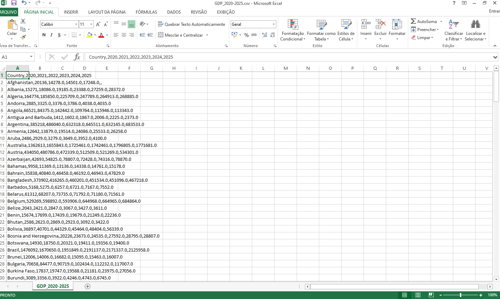
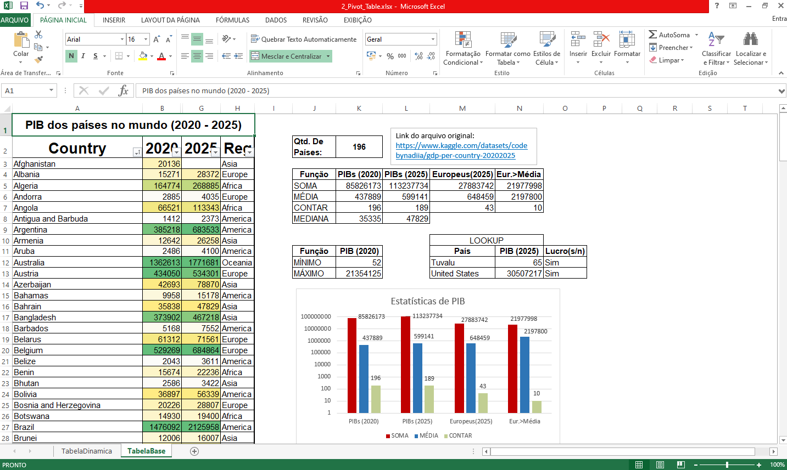
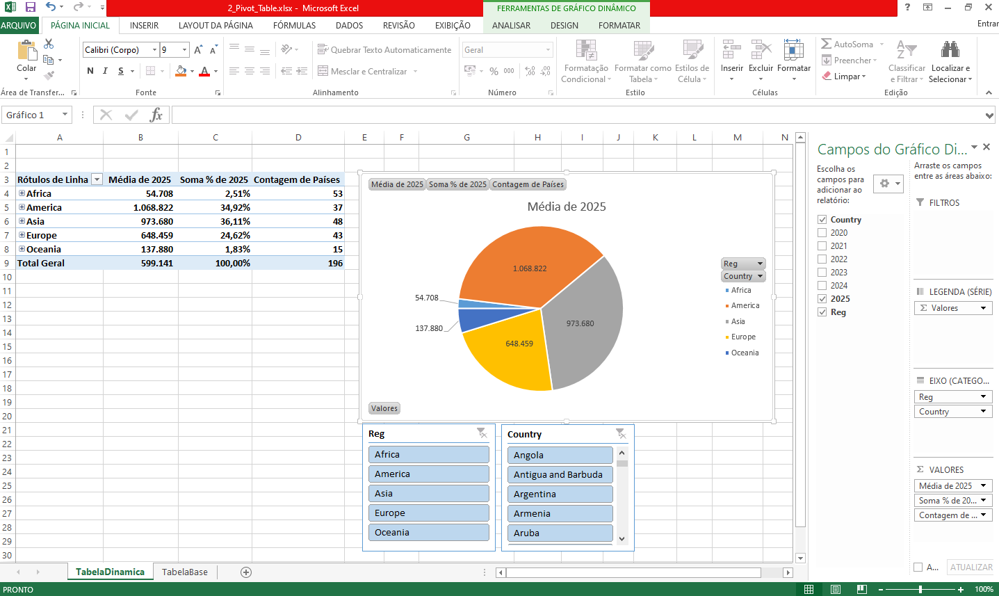

# Introdução
Esse projeto de visualização, organização e cálculo de dados serve para explorar o programa Microsoft Excel, um dos mais usados nos escritórios do mundo todo, especialmente por profissionais da área de dados.

Trabalharemos com uma pequena base de dados (197 linhas incluindo os títulos) que mostra os PIBs dos países no mundo de 2020 até 2025. O arquivo original vem em formato CSV como está abaixo.

# Ferramentas que Usei
- Usei ***GIT/GitHub*** para subir meu projeto para o repositório e torná-lo público, facilitando assim o acesso de todos.
- Usei ***Excel*** para organizar, limpar, calcular, formatar e visualizar os dados coletados.
- Usei ***VS Code*** para criar e editar o arquivo ReadMe.md e estabelecer Source Control.

# A Análise
Esse projeto de dividirá em duas partes:

Primeiramente, a conversão do arquivo em para o formato XLSX. Ao lado da tabela principal devem ser colocadas pequenas tabelas que visam explorar funções básicas de uso geral, como SOMA, MÉDIA, PROCV, etc. A tabela original deve ser formatada e também deve incluir um gráfico para demonstrar visualização.

A primeira análise conclui que a economia do mundo avançou nos últimos cinco anos (pela soma dos PIBs). O menor PIB em 2025 é o de Tuvalu e o maior é o dos Estados Unidos. Ambos os países tiveram um aumento no PIB desde 2020. Observa-se também que na Europa (região escolhida arbitrariamente) a maioria dos países corresponde à menor parte do PIB total da região.

Na segunda parte, será demonstrado Tabela Dinâmica (Pivot Table) com hierarquia e Gráfico Dinâmico com segmentação de dados e filtros.

A segunda análise nos mostra que a maior parte do PIB do mundo está nos continentes América, Ásia e Europa. A África, apesar de ter a maior quantidade de países, tem o segundo menor PIB total e a menor média do mundo. Após aplicarmos alguns filtros, veremos também que alguns países influenciam bastante o valor do PIB nas regiões, como os Estados Unidos na América, a China na Ásia e a Austrália na Oceania.

# O Que Aprendi

Na primeira parte, aprendi a transformar arquivos do formato CSV para arquivos XLSX separando por colunas com a feramenta "Obter Dados de Texto" na seção "Dados" e explorei diversas opções de personalização (fontes, tamanhos de letra, bordas, etc.) de tabelas. Aprendi as funções SOMA, SOMASE, SOMASES, MÉDIA, MÉDIASE, MÉDIASES, CONT.NÚM, CONT.VALORES, CONT.SE, CONT.SES, MED, PROCV, ÍNDICE-CORRESP, SE, MÍNIMO e MÁXIMO. Aprendi também testes lógicos (verdadeiro ou falso), formatação condicional de tabelas, inserção e formatação de gráficos, filtros, localizar e substituir, comentários, etc.

(obs: é muito importante notar que várias dessas funções já era do meu conhecimento prévio de Excel, pois fui introduzido à ferramenta em um curso de informática em 2016 e usei ela várias vezes durante o curso Técnico em Administração do SENAC (2023-2024).)

Na segunda parte, aprendi a usar tabela dinâmica para organizar, analisar e resumir dados de forma interativa. Usei de hierarquias, segmentação de dados e outros filtros para selecionar ou limitar dados específicos a depender do interesse da análise. Usei de gráficos dinâmicos para visualizar os dados selecionados na tabela.

# Conclusões

Há habilidades que não foram possíveis de se desenvolver e/ou aprimorar por conta da versão do Excel em uso (2013) e algumas funções só estarem presentes em versões posteriores, como Matrizes Dinâmicas, cálculos de MODA, cálculos com matrizes, etc.

Porém, em grande parte, foi possível consolidar as habilidades básicas de uso cotidiano geral (como funções e formatações) e desenvolver habilidades fundamentais para a carreira de análise de dados (como Tabela Dinâmica, visualizações com gráficos e uso de filtros).